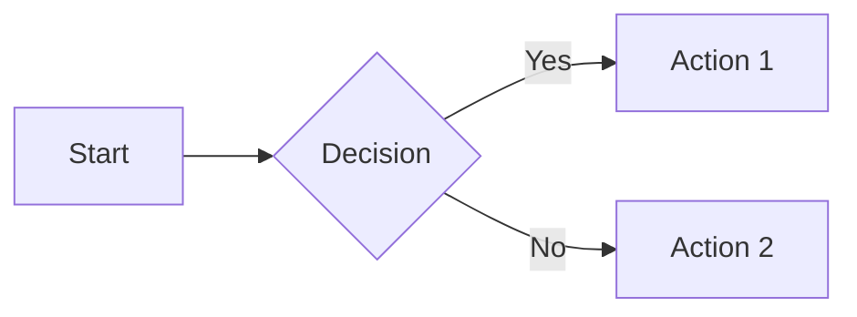

# mema - mermaid-ed markdown viewer

Markdown with Mermaid diagrams to terminal output.

## Install

```bash
npm install -g ktrysmt/mema
```

Or from GitHub:

```bash
npm install -g git+https://github.com/ktrysmt/mema.git
```

## Usage

### File input

```bash
mema <markdown-file>
mema file1.md file2.md file3.md
```

### Stdin input

```bash
echo "# Hello\n\n```mermaid\nflowchart LR\n    A-->B\n```" | mema
cat README.md | mema
```

## Example

Input (`test.md`):

```markdown
# Test


```

Output:

```
=== test.md ===

# Test

    ┌──────┐     ┌──────────┐
    │      │     │          │
    │ Start├────►│ Decision ├─Yes►──┐
    │      │     │          │       │
    └──────┘     └────┬─────┘       │
                     │              │
                     │              │
                    No              │
                     │              │
                     │          ┌───┴───┐
                     │          │       │
                     └─────────►│ Action│
                                │       │
                                └───────┘
```
