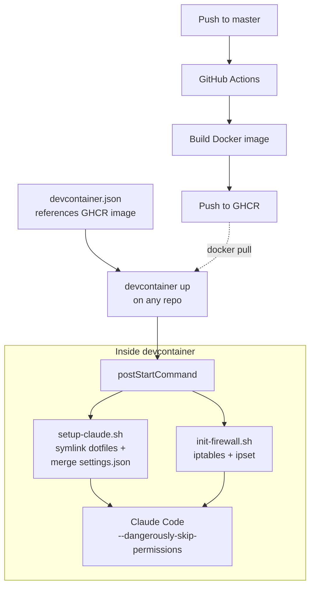

```mermaid
graph TD
  A[Push to master] --> B[GitHub Actions]
  B --> C[Build Docker image]
  C --> D[Push to GHCR]
  E[devcontainer.json<br>references GHCR image] --> F[devcontainer up<br>on any repo]
  D -.-> |docker pull| F
  F --> G[postStartCommand]
  subgraph container [Inside devcontainer]
    G --> H[setup-claude.sh<br>symlink dotfiles +<br>merge settings.json]
    G --> I[init-firewall.sh<br>iptables + ipset]
    H --> J[Claude Code<br>--dangerously-skip-permissions]
    I --> J
  end
```
