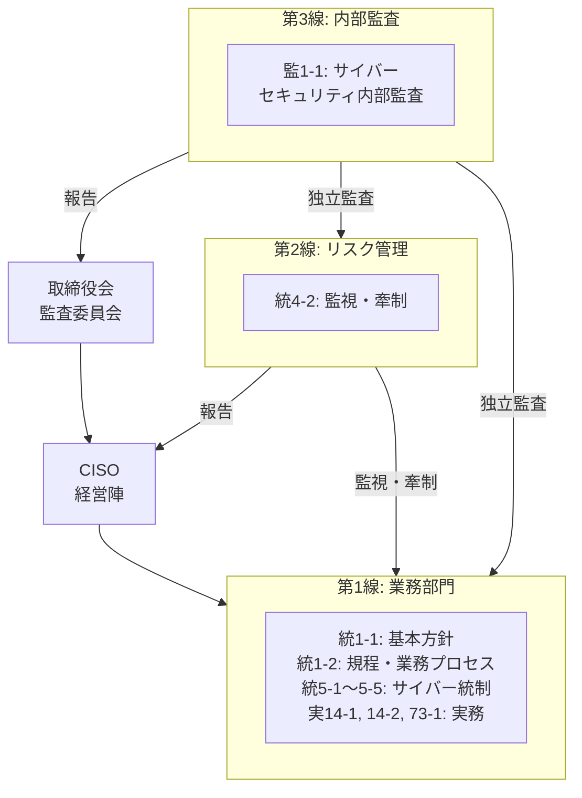

```mermaid
graph TD
    BOD["取締役会<br>監査委員会"]
    CISO["CISO<br>経営陣"]

    subgraph L1["第1線: 業務部門"]
        OP["統1-1: 基本方針<br>統1-2: 規程・業務プロセス<br>統5-1〜5-5: サイバー統制<br>実14-1, 14-2, 73-1: 実務"]
    end

    subgraph L2["第2線: リスク管理"]
        RM["統4-2: 監視・牽制"]
    end

    subgraph L3["第3線: 内部監査"]
        IA["監1-1: サイバー<br>セキュリティ内部監査"]
    end

    BOD --> CISO
    CISO --> L1
    L2 -->|"監視・牽制"| L1
    L3 -->|"独立監査"| L1
    L3 -->|"独立監査"| L2
    L3 -->|"報告"| BOD
    L2 -->|"報告"| CISO
```
