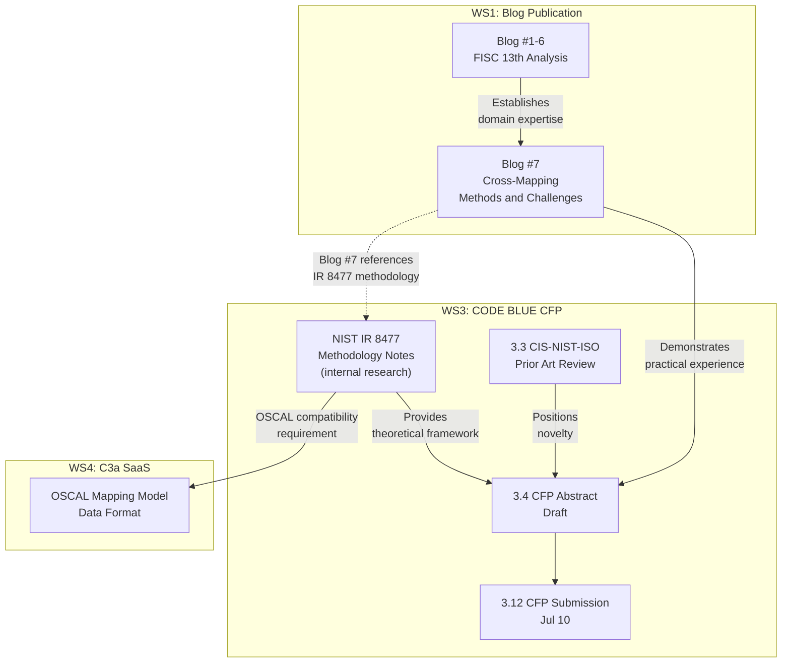

```mermaid
graph TD
    subgraph WS1["WS1: Blog Publication"]
        B1["Blog #1-6<br>FISC 13th Analysis"]
        B7["Blog #7<br>Cross-Mapping<br>Methods and Challenges"]
    end

    subgraph WS3["WS3: CODE BLUE CFP"]
        IR["NIST IR 8477<br>Methodology Notes<br>(internal research)"]
        CE["3.3 CIS-NIST-ISO<br>Prior Art Review"]
        AB["3.4 CFP Abstract<br>Draft"]
        SUB["3.12 CFP Submission<br>Jul 10"]
    end

    subgraph WS4["WS4: C3a SaaS"]
        OSCAL["OSCAL Mapping Model<br>Data Format"]
    end

    B1 -->|"Establishes<br>domain expertise"| B7
    B7 -->|"Demonstrates<br>practical experience"| AB
    IR -->|"Provides<br>theoretical framework"| AB
    CE -->|"Positions<br>novelty"| AB
    AB --> SUB
    IR -->|"OSCAL compatibility<br>requirement"| OSCAL
    B7 -.->|"Blog #7 references<br>IR 8477 methodology"| IR
```
