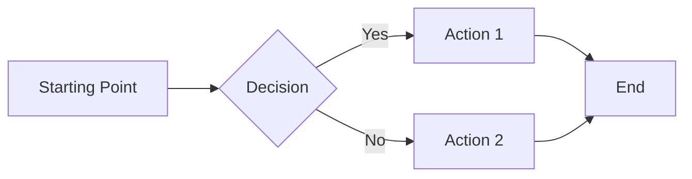
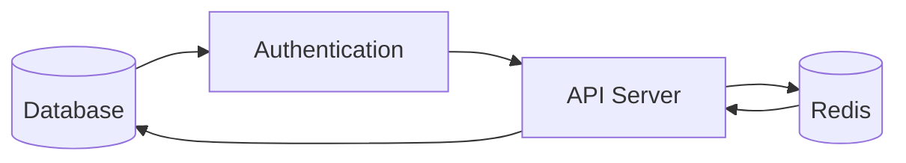
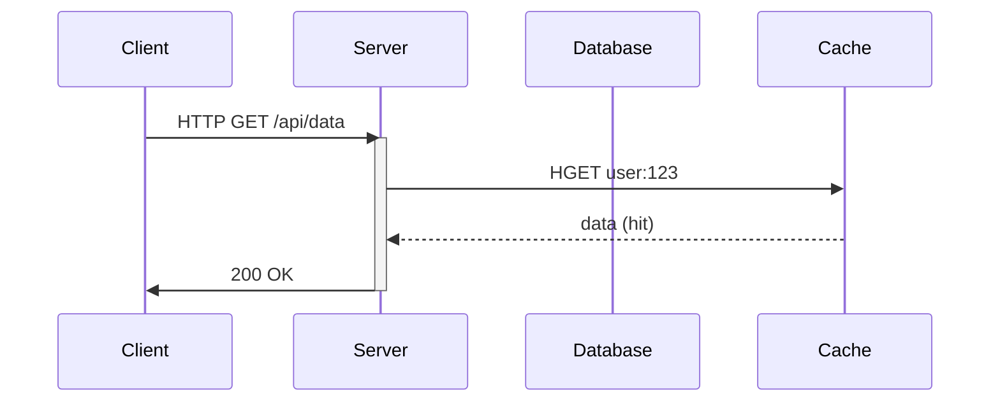
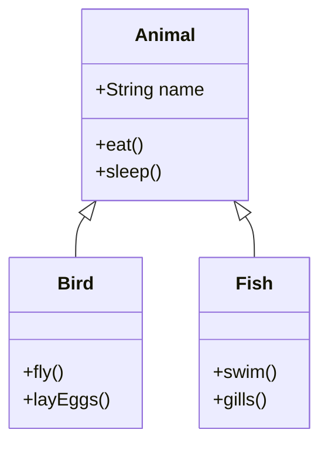
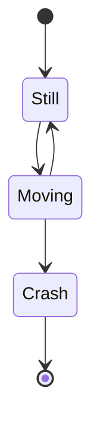
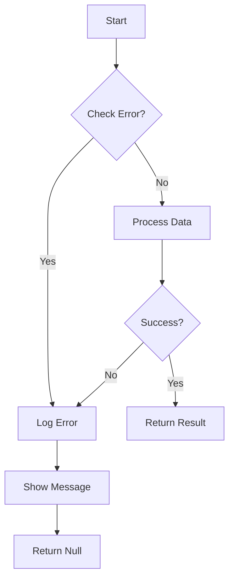
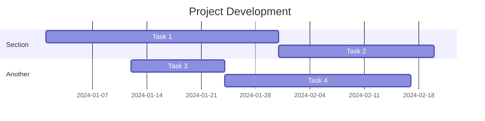

# Complex Mermaid Diagrams Test

## flowchart LR Test

## Sequence Diagram

## Class Diagram

## State Diagram

## Error Handling Example

## Gantt Chart (not supported by beautiful-mermaid)

## Regular Text

This is regular text between mermaid diagrams.

- Point 1
- Point 2
- Point 3

`Inline code` is also supported.

**Bold** and *italic* text work fine.

